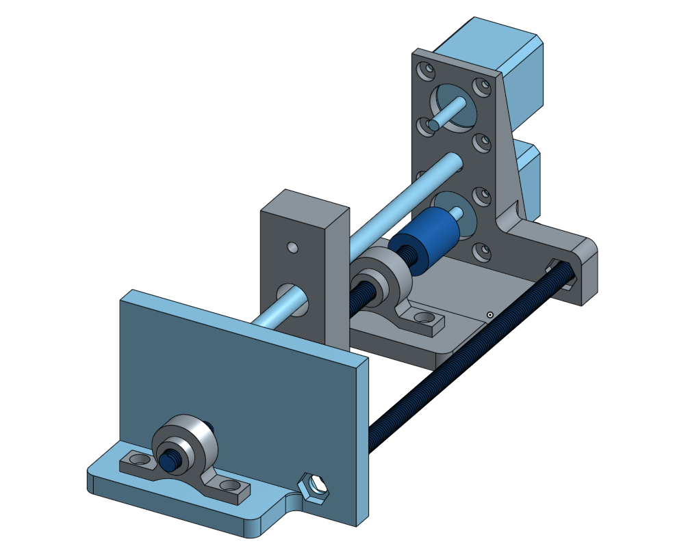

# Computer-Aided Design

I just like building, making and testing sensors and mechnical curiousities. 

## An automatic artificial muscle winding system

Artifical muscles can be produced using a simple filament winding method that produces a helix [[1]](http://science.sciencemag.org/content/343/6173/868). The sewing thread or fishing line is attached to the drill and a weight attached. As the drill spins the nylon line first twists and then starts to produce a helix structure as the twists pile-up on the filament [[2]](https://www.youtube.com/watch?v=1A2LUbJjDQ0). 

The production of actuators in this fashion is extremely low-cost compared to traditional motor-based techniques and gives good performance: Artifical muscles can contract upto 49% and lifts around 100 times the weight of the human. 

This was inspired by a previous design with a video [here](https://www.youtube.com/watch?v=iMMGfzYXwAU). So there seem to be a few stages to the production: 

1. Winding heater wire around the pre-wound nylon filament
2. Twisting the nylon filament to induce coiling

I was interested in the artificial muscle itself and less so about integrating the heater wire around the filament (maybe at a later iteration). So I started to sketch the design focussing on step 2, the twisting of the nylon filament to induce the coiling. 

The upper NEMA14 stepper actually performs the coiling. The lower stepper moves the upper filament guide to or away from the upper stepper. 

The design is based in the cloud at [OnShape](https://cad.onshape.com/documents/d8cfb3fe114fd1b4f46390e4/w/83a8605fd9dbd7406fb6c8f0/e/be26834f6866e28efb1d0bc9)

